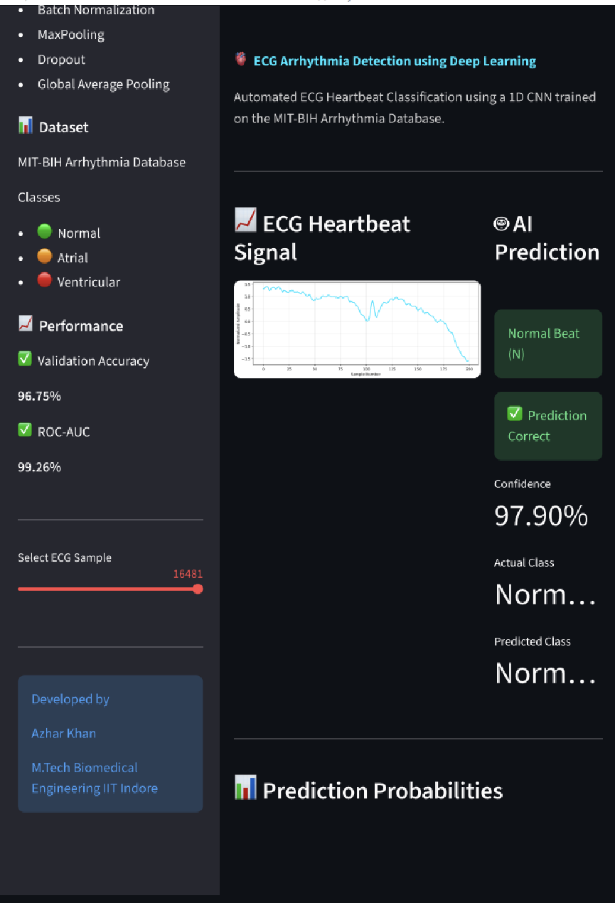
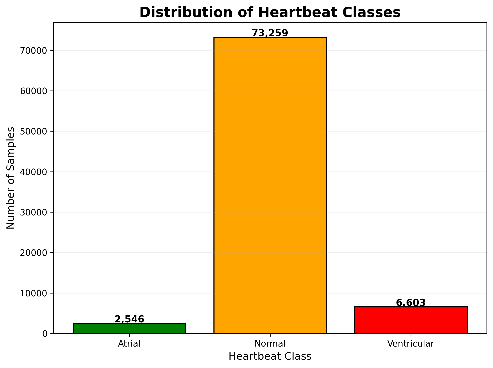
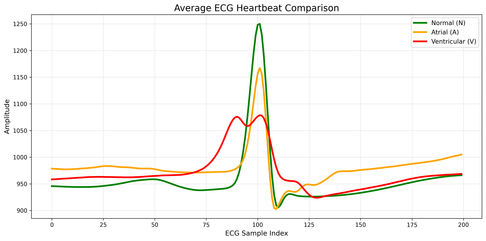
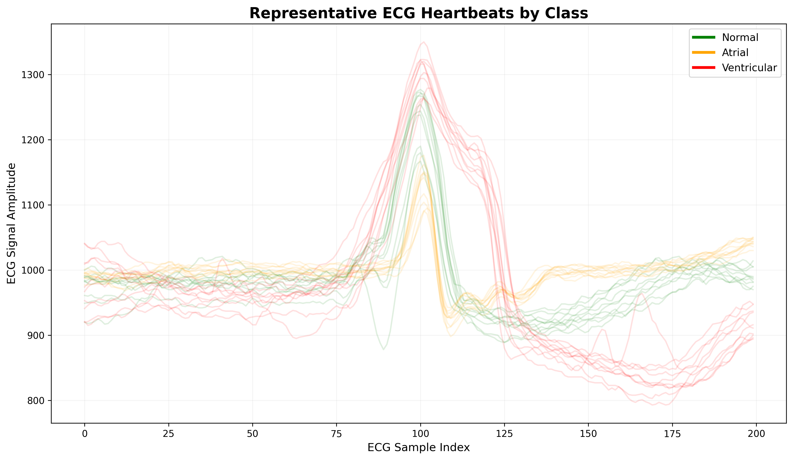
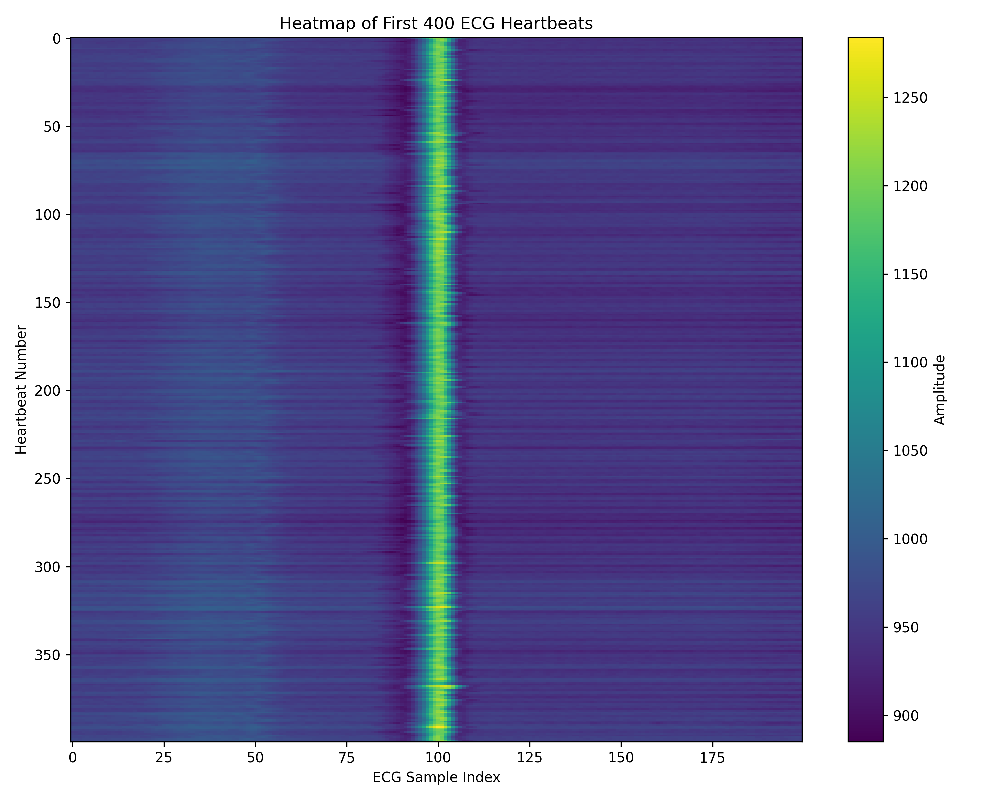
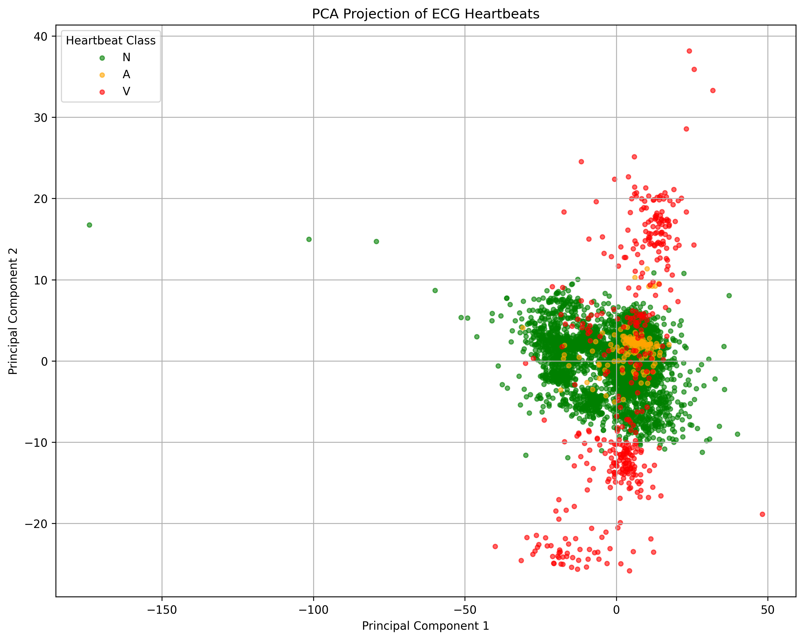
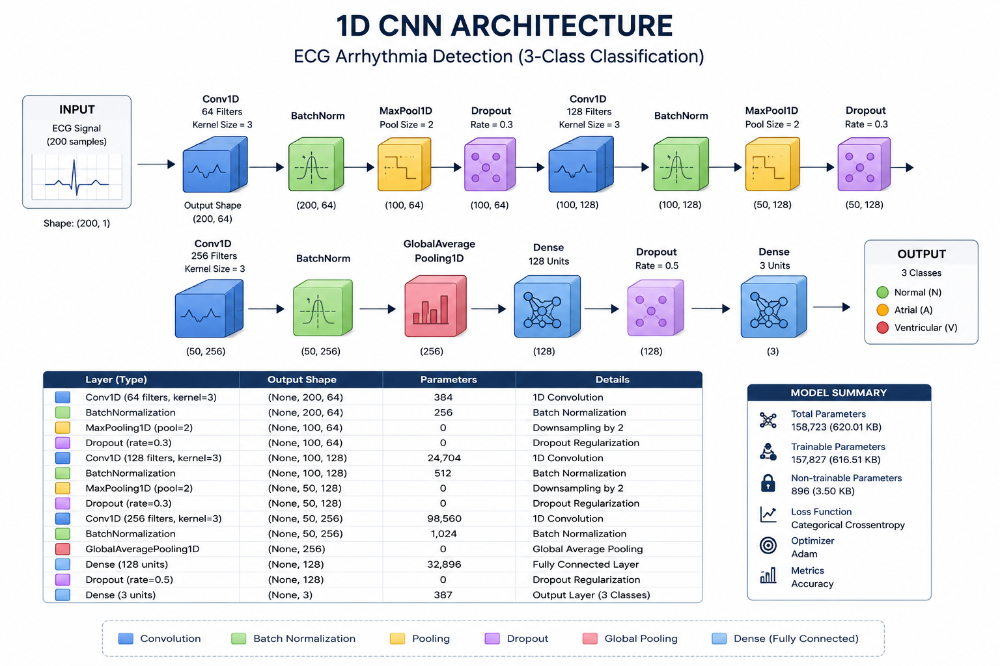
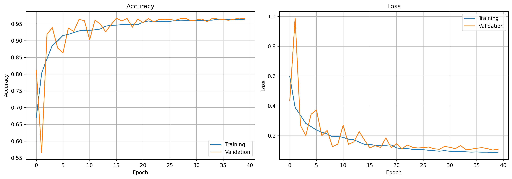
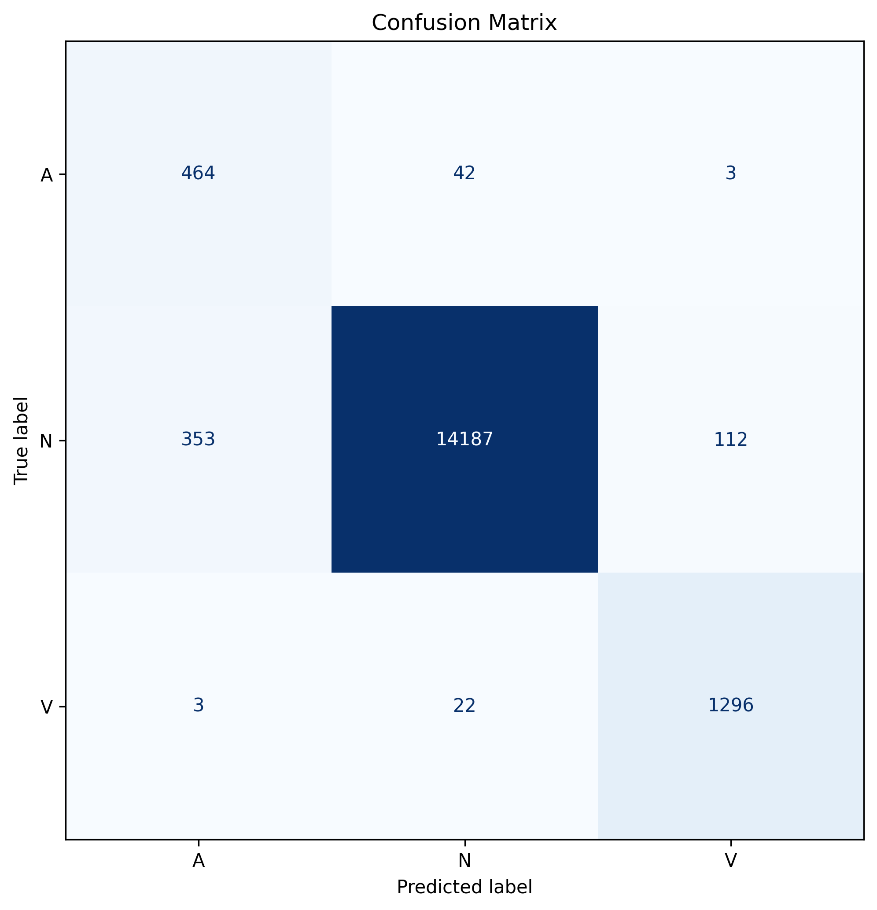
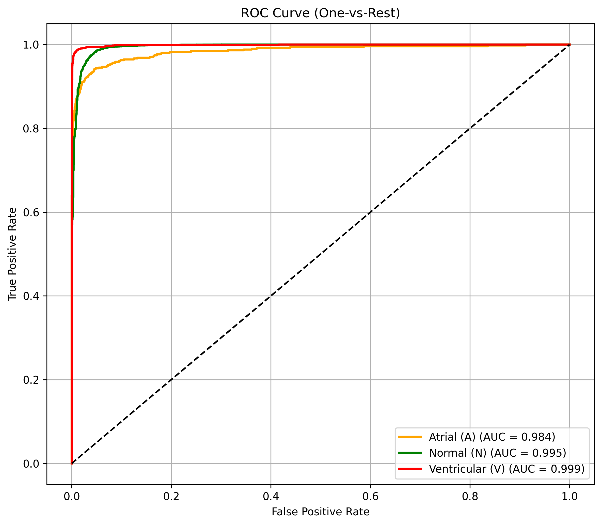

# ❤️ ECG Arrhythmia Detection using Deep Learning

A Deep Learning-based ECG Arrhythmia Detection system developed using a **1D Convolutional Neural Network (1D CNN)** for automatic heartbeat classification. The project utilizes the **MIT-BIH Arrhythmia Database** to classify ECG heartbeats into **Normal (N), Atrial Premature Beat (A), and Ventricular Premature Beat (V)**.

The repository includes complete **data preprocessing, exploratory data analysis (EDA), model training, evaluation, inference, and an interactive Streamlit web application** for real-time heartbeat visualization and prediction.

---

# 🚀 Streamlit Dashboard



The Streamlit application allows users to:

- Visualize ECG heartbeat signals
- Predict heartbeat class
- Display prediction confidence
- View probability distribution
- Explore different heartbeat samples interactively

---

# 📌 Project Highlights

- MIT-BIH Arrhythmia Database
- ECG Beat Extraction using R-Peak annotations
- Heartbeat segmentation (200 Samples)
- 1D CNN Architecture
- TensorFlow/Keras Implementation
- Complete Exploratory Data Analysis
- Streamlit Deployment
- Model Evaluation using multiple metrics

---

# 📂 Dataset Information

| Parameter | Value |
|-----------|-------|
| Dataset | MIT-BIH Arrhythmia Database |
| Sampling Frequency | **360 Hz** |
| ECG Lead | MLII (Primary), V5 (Fallback) |
| Beat Window | **200 Samples (100 Before + 100 After R-Peak)** |
| Heartbeat Classes | Normal (N), Atrial (A), Ventricular (V) |

---

# ❤️ Heartbeat Distribution



The dataset is naturally imbalanced, with Normal beats being the majority class. This makes heartbeat classification a challenging multi-class learning problem.

---

# 📈 ECG Waveform Analysis

## Average ECG Heartbeat Comparison



The average heartbeat morphology clearly highlights structural differences among the three heartbeat classes.

---

## Representative ECG Waveforms



Representative ECG beats from each heartbeat class demonstrate morphological variability, especially for Ventricular arrhythmias.

---

## ECG Heatmap



The ECG heatmap visualizes hundreds of heartbeat segments simultaneously, illustrating consistent R-peak alignment after preprocessing.

---

## PCA Visualization



Principal Component Analysis (PCA) projects high-dimensional ECG signals into two dimensions for exploratory visualization of heartbeat class distribution.

---

# 🧠 Deep Learning Model

## CNN Architecture



The proposed 1D CNN architecture consists of:

- Conv1D Layers
- Batch Normalization
- MaxPooling
- Dropout
- Global Average Pooling
- Dense Classifier

Total Parameters:

**158,723**

Trainable Parameters:

**157,827**

---

# 📊 Training Performance



Training and validation curves indicate stable convergence with minimal overfitting.

---

# 📉 Confusion Matrix



The confusion matrix demonstrates strong classification performance across all heartbeat classes.

---

# 📈 ROC Curve



The model achieved excellent discrimination capability with ROC-AUC values close to 1.0 for all heartbeat classes.

---

# 📊 Model Performance

| Metric | Score |
|---------|-------|
| Validation Accuracy | **96.75%** |
| ROC-AUC | **99.26%** |
| Classes | **3** |
| Total Parameters | **158,723** |

---

# 🛠 Technologies Used

- Python
- TensorFlow
- Keras
- NumPy
- Pandas
- Matplotlib
- Scikit-learn
- Streamlit

---

# 📁 Repository Structure

```
ECG-Arrhythmia-Detection/
│
├── images/
│   ├── average_heartbeat_comparison.png
│   ├── class_distribution.png
│   ├── cnn_architecture.png
│   ├── confusion_matrix.png
│   ├── ecg_heatmap.png
│   ├── ecg_overlay.png
│   ├── pca_visualization.png
│   ├── roc_curve.png
│   ├── streamlit_dashboard.png
│   └── training_curves.png
│
├── models/
│   └── ecg_arrhythmia_cnn.keras
│
├── notebooks/
│   ├── 01_EDA_and_Data_Preprocessing.ipynb
│   ├── 02_Model_Training.ipynb
│   └── 03_Model_Inference.ipynb
│
├── results/
│   └── PROJECT_SUMMARY.md
│
├── app.py
├── requirements.txt
├── .gitignore
└── README.md

Note: The MIT-BIH Arrhythmia dataset is not included in this repository due to repository size constraints. Download the dataset separately and place it in the dataset/ directory before running the notebooks.
```

---

# 📌 Results Summary

Detailed experimental observations, dataset statistics, preprocessing methodology, and final model insights are available in:

```
results/PROJECT_SUMMARY.md
```

---

# 👨‍💻 Author

**Azhar Khan**

M.Tech Biomedical Engineering

Indian Institute of Technology Indore

---

⭐ If you found this project useful, consider giving it a **Star** on GitHub.# ECG-Arrhythmia-Detection
